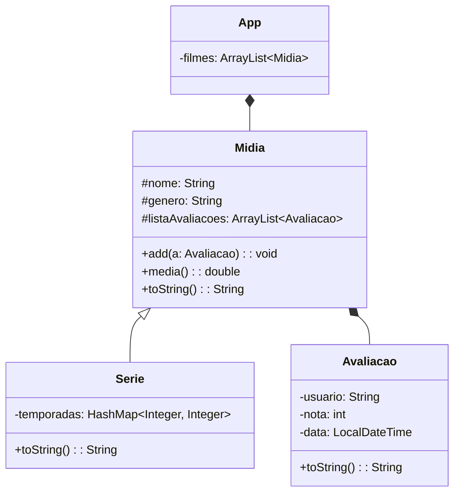

```mermaid
classDiagram
    class Midia {
        #nome: String
        #genero: String
        #listaAvaliacoes: ArrayList~Avaliacao~
        +add(a: Avaliacao): void
        +media(): double
        +toString(): String
    }
    
    class Serie {
        -temporadas: HashMap~Integer, Integer~
        +toString(): String
    }
    
    class Avaliacao {
        -usuario: String
        -nota: int
        -data: LocalDateTime
        +toString(): String
    }
    
    class App {
        -filmes: ArrayList~Midia~
    }
    
    Midia <|-- Serie
    Midia *-- Avaliacao
    App *-- Midia
```