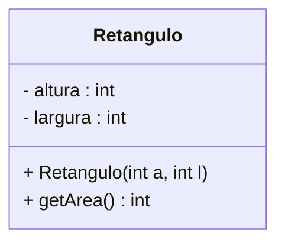
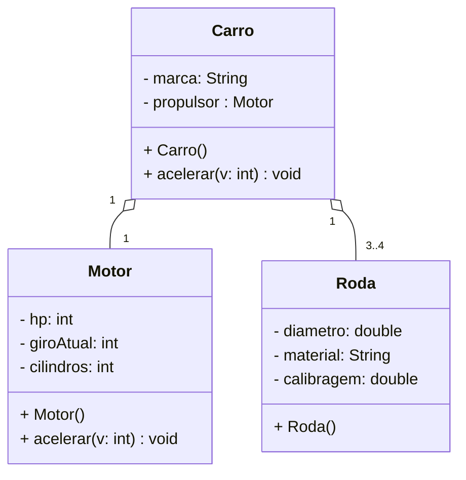
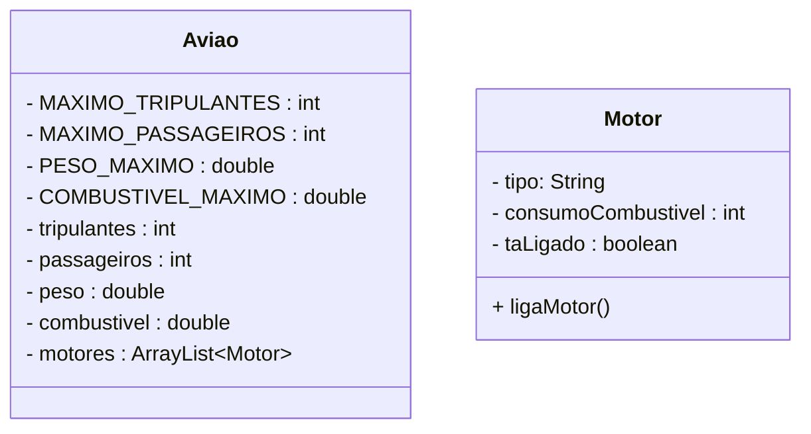

```mermaid
classDiagram
    direction LR
    
    class Retangulo{
        - altura : int
        - largura : int
        + Retangulo(int a, int l)
        + getArea() int
    }
```

```mermaid
classDiagram
    Carro "1" o-- "1" Motor
    Carro "1" o-- "3..4" Roda
    class Carro {
        - marca: String
        - propulsor : Motor
        + Carro()
        + acelerar(v: int) void
    }
    class Motor {
        - hp: int
        - giroAtual: int
        - cilindros: int
        + Motor()
        + acelerar(v: int) void
    }
    class Roda {
        - diametro: double
        - material: String
        - calibragem: double
        + Roda()
    }
```

```mermaid
classDiagram
    class Aviao {
        - MAXIMO_TRIPULANTES : int
        - MAXIMO_PASSAGEIROS : int
        - PESO_MAXIMO : double
        - COMBUSTIVEL_MAXIMO : double
        - tripulantes : int
        - passageiros : int
        - peso : double
        - combustivel : double
        - motores : ArrayList~Motor~
    }
    
    class Motor {
        - tipo: String
        - consumoCombustivel : int
        - taLigado : boolean
        + ligaMotor()
    }
```
