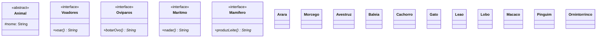

```mermaid
classDiagram
    class Animal{
        <<abstract>>
        #nome: String
        
    }
    
    class Voadores {
        <<interface>>
        +voar() String*
    }
    
    class Oviparos {
        <<interface>>
        +botarOvo() String*
    }
    
    class Maritmo {
        <<interface>>
        +nadar() String*
    }
    
    class Mamifero {
        <<interface>>
        +produzLeite() String*
    }
    
    class Arara{
        
    }
    class Morcego{
        
    }
    class Avestruz{
        
    }
    class Baleia{
        
    }
    class Cachorro{
        
    }
    class Gato{
        
    }
    class Leao{
        
    }
    class Lobo{
        
    }
    class Macaco{
        
    }
    class Morcego{
        
    }
    class Pinguim{
        
    }
    class Ornintorrinco{
        
    }
```